# Use Case Diagram - Admin Actor

## AI English Speaking Practice Platform (AESP)

---

## 1. PlantUML Use Case Diagram

```plantuml
@startuml Admin_UseCase_Diagram
!theme plain
skinparam backgroundColor white
skinparam actorStyle awesome
skinparam usecaseFontSize 11
skinparam packageFontSize 13

left to right direction

actor "Admin" as admin #3B82F6

' ============ DASHBOARD ============
rectangle "📊 Dashboard Management" as DashboardPkg #E3F2FD {
    usecase "Xem thống kê tổng quan" as UC_ViewStats
    usecase "Xem biểu đồ doanh thu" as UC_RevenueChart
    usecase "Xem tăng trưởng người dùng" as UC_UserGrowth
    usecase "Xem trạng thái hệ thống" as UC_SystemStatus
    usecase "Xem thống kê AI usage" as UC_AIUsage
    usecase "Xem pending actions" as UC_PendingActions
    usecase "Xem hoạt động gần đây" as UC_RecentActivities
}

' ============ USER MANAGEMENT ============
rectangle "👥 User Management" as UserPkg #E8F5E9 {
    usecase "Xem danh sách users" as UC_ViewUsers
    usecase "Tìm kiếm user" as UC_SearchUser
    usecase "Xem chi tiết user" as UC_ViewUserDetail
    usecase "Cập nhật thông tin user" as UC_UpdateUser
    usecase "Kích hoạt/Vô hiệu hóa user" as UC_ToggleUser
    usecase "Reset mật khẩu user" as UC_ResetPassword
    usecase "Xóa user" as UC_DeleteUser
}

' ============ MENTOR MANAGEMENT ============
rectangle "🎓 Mentor Management" as MentorPkg #FFF3E0 {
    usecase "Xem danh sách mentors" as UC_ViewMentors
    usecase "Xem chi tiết mentor" as UC_ViewMentorDetail
    usecase "Duyệt mentor pending" as UC_ApproveMentor
    usecase "Cập nhật trạng thái mentor" as UC_UpdateMentorStatus
    usecase "Xem thống kê mentor" as UC_MentorStats
    usecase "Phân công mentor-learner" as UC_AssignMentor
}

' ============ LEARNER SUPPORT ============
rectangle "🎫 Learner Support" as SupportPkg #FCE4EC {
    usecase "Xem danh sách tickets" as UC_ViewTickets
    usecase "Xem chi tiết ticket" as UC_ViewTicketDetail
    usecase "Cập nhật trạng thái ticket" as UC_UpdateTicketStatus
    usecase "Trả lời ticket" as UC_ReplyTicket
    usecase "Xem thống kê support" as UC_SupportStats
}

' ============ FEEDBACK MODERATION ============
rectangle "📝 Feedback Moderation" as FeedbackPkg #F3E5F5 {
    usecase "Xem danh sách feedback" as UC_ViewFeedback
    usecase "Duyệt feedback" as UC_ApproveFeedback
    usecase "Ẩn/Xóa feedback vi phạm" as UC_HideFeedback
    usecase "Phản hồi feedback" as UC_RespondFeedback
}

' ============ PACKAGE & SUBSCRIPTION ============
rectangle "📦 Package Management" as PkgMgmt #E0F7FA {
    usecase "Xem danh sách gói" as UC_ViewPackages
    usecase "Tạo gói mới" as UC_CreatePackage
    usecase "Cập nhật gói" as UC_UpdatePackage
    usecase "Kích hoạt/Vô hiệu hóa gói" as UC_TogglePackage
    usecase "Xem lịch sử mua hàng" as UC_ViewPurchases
}

' ============ REPORTS & ANALYTICS ============
rectangle "📈 Reports & Analytics" as ReportsPkg #FFF8E1 {
    usecase "Xem báo cáo doanh thu" as UC_RevenueReport
    usecase "Xem báo cáo người dùng" as UC_UserReport
    usecase "Xem báo cáo mentor" as UC_MentorReport
    usecase "Xuất báo cáo Excel/PDF" as UC_ExportReport
    usecase "Xem biểu đồ phân tích" as UC_ViewCharts
}

' ============ SETTINGS ============
rectangle "⚙️ System Settings" as SettingsPkg #ECEFF1 {
    usecase "Cấu hình cài đặt chung" as UC_GeneralSettings
    usecase "Cấu hình bảo mật" as UC_SecuritySettings
    usecase "Cấu hình hiệu năng" as UC_PerformanceSettings
    usecase "Quản lý chính sách" as UC_PolicyManagement
}

' ============ PROFILE ============
rectangle "👤 Admin Profile" as ProfilePkg #E1F5FE {
    usecase "Xem profile cá nhân" as UC_ViewProfile
    usecase "Cập nhật profile" as UC_UpdateProfile
    usecase "Đổi mật khẩu" as UC_ChangePassword
}

' ============ RELATIONSHIPS ============
admin --> UC_ViewStats
admin --> UC_RevenueChart
admin --> UC_UserGrowth
admin --> UC_SystemStatus
admin --> UC_AIUsage
admin --> UC_PendingActions
admin --> UC_RecentActivities

admin --> UC_ViewUsers
admin --> UC_SearchUser
admin --> UC_ViewUserDetail
admin --> UC_UpdateUser
admin --> UC_ToggleUser
admin --> UC_ResetPassword
admin --> UC_DeleteUser

admin --> UC_ViewMentors
admin --> UC_ViewMentorDetail
admin --> UC_ApproveMentor
admin --> UC_UpdateMentorStatus
admin --> UC_MentorStats
admin --> UC_AssignMentor

admin --> UC_ViewTickets
admin --> UC_ViewTicketDetail
admin --> UC_UpdateTicketStatus
admin --> UC_ReplyTicket
admin --> UC_SupportStats

admin --> UC_ViewFeedback
admin --> UC_ApproveFeedback
admin --> UC_HideFeedback
admin --> UC_RespondFeedback

admin --> UC_ViewPackages
admin --> UC_CreatePackage
admin --> UC_UpdatePackage
admin --> UC_TogglePackage
admin --> UC_ViewPurchases

admin --> UC_RevenueReport
admin --> UC_UserReport
admin --> UC_MentorReport
admin --> UC_ExportReport
admin --> UC_ViewCharts

admin --> UC_GeneralSettings
admin --> UC_SecuritySettings
admin --> UC_PerformanceSettings
admin --> UC_PolicyManagement

admin --> UC_ViewProfile
admin --> UC_UpdateProfile
admin --> UC_ChangePassword

' ============ INCLUDE/EXTEND ============
UC_ViewMentorDetail ..> UC_ViewMentors : <<include>>
UC_UpdateMentorStatus ..> UC_ViewMentorDetail : <<include>>
UC_ApproveMentor ..> UC_ViewMentorDetail : <<include>>

UC_ViewTicketDetail ..> UC_ViewTickets : <<include>>
UC_UpdateTicketStatus ..> UC_ViewTicketDetail : <<include>>
UC_ReplyTicket ..> UC_ViewTicketDetail : <<include>>

UC_ViewUserDetail ..> UC_ViewUsers : <<include>>
UC_UpdateUser ..> UC_ViewUserDetail : <<include>>
UC_ToggleUser ..> UC_ViewUserDetail : <<include>>
UC_ResetPassword ..> UC_ViewUserDetail : <<include>>
UC_DeleteUser ..> UC_ViewUserDetail : <<include>>

UC_UpdatePackage ..> UC_ViewPackages : <<include>>
UC_TogglePackage ..> UC_ViewPackages : <<include>>

UC_ExportReport .left.> UC_RevenueReport : <<extend>>
UC_ExportReport .left.> UC_UserReport : <<extend>>
UC_ExportReport .left.> UC_MentorReport : <<extend>>

@enduml
```

---

## 2. Mô tả chi tiết Use Cases

### 2.1 📊 Dashboard Management

| Use Case | Mô tả | Input | Output |
|----------|-------|-------|--------|
| Xem thống kê tổng quan | Hiển thị KPIs: tổng users, doanh thu, AI lessons, mentors | - | Stats card với % thay đổi |
| Xem biểu đồ doanh thu | Biểu đồ doanh thu theo thời gian | Period (7d/30d/90d/1y) | Chart data |
| Xem tăng trưởng người dùng | Biểu đồ số lượng user mới | Period | Growth chart |
| Xem trạng thái hệ thống | CPU, Memory, Disk, Database status | - | System metrics |
| Xem thống kê AI usage | Số lượng AI conversations, tokens | Period | AI usage stats |
| Xem pending actions | Các tác vụ cần xử lý | Limit | Pending items list |
| Xem hoạt động gần đây | Log hoạt động hệ thống | Limit | Activity log |

---

### 2.2 👥 User Management

| Use Case | Actor | Precondition | Flow | Postcondition |
|----------|-------|--------------|------|---------------|
| Xem danh sách users | Admin | Đăng nhập | 1. Mở trang Users 2. Hệ thống load danh sách | Hiển thị bảng users với pagination |
| Tìm kiếm user | Admin | Đang ở trang Users | 1. Nhập keyword 2. Chọn filters 3. Hệ thống tìm kiếm | Danh sách users phù hợp |
| Xem chi tiết user | Admin | Có user trong danh sách | 1. Click user 2. Mở modal chi tiết | Hiển thị thông tin đầy đủ |
| Cập nhật thông tin user | Admin | Đang xem chi tiết | 1. Sửa thông tin 2. Click Save 3. Validate & lưu | User được cập nhật |
| Kích hoạt/Vô hiệu hóa user | Admin | Đang xem chi tiết | 1. Toggle status 2. Confirm | Status thay đổi |
| Reset mật khẩu user | Admin | Đang xem chi tiết | 1. Click Reset 2. Confirm 3. Gửi email | User nhận email reset |
| Xóa user | Admin | Đang xem chi tiết | 1. Click Delete 2. Confirm x2 | User bị soft delete |

---

### 2.3 🎓 Mentor Management

| Use Case | Mô tả | Business Rules |
|----------|-------|----------------|
| Xem danh sách mentors | Hiển thị tất cả mentors với filters | Filter by: status (active/pending/inactive) |
| Xem chi tiết mentor | Thông tin mentor + learners + ratings | Include: statistics, reviews, sessions |
| Duyệt mentor pending | Phê duyệt đơn đăng ký mentor mới | Status: pending → active |
| Cập nhật trạng thái mentor | Active ↔ Inactive toggle | Notify mentor via email |
| Xem thống kê mentor | Total, Active, Pending, Avg Rating | Real-time from database |
| Phân công mentor-learner | Gán learner cho mentor | Check mentor capacity |

---

### 2.4 🎫 Learner Support

| Use Case | Priority Levels | Status Flow |
|----------|-----------------|-------------|
| Xem danh sách tickets | Low, Medium, High, Urgent | Filter by status/priority |
| Xem chi tiết ticket | - | Include: messages history |
| Cập nhật trạng thái ticket | - | Open → In Progress → Resolved → Closed |
| Trả lời ticket | - | Add message to ticket |
| Xem thống kê support | - | Open, In Progress, Resolved, Avg Response Time |

---

### 2.5 📦 Package Management

| Use Case | Fields | Validation |
|----------|--------|------------|
| Xem danh sách gói | Name, Price, Duration, Features | - |
| Tạo gói mới | Name, Description, Price, Duration, has_mentor, features | Price > 0, Duration > 0 |
| Cập nhật gói | Tất cả fields | Không ảnh hưởng purchases hiện tại |
| Kích hoạt/Vô hiệu hóa gói | is_active | Gói inactive không hiển thị cho users |
| Xem lịch sử mua hàng | User, Package, Amount, Status, Date | Filter by date range |

---

### 2.6 ⚙️ System Settings

| Setting Category | Parameters |
|------------------|------------|
| **General Settings** | Site name, Site URL, Timezone, Language, Logo |
| **Security Settings** | Session timeout, Max login attempts, Password policy, 2FA required |
| **Performance Settings** | Cache duration, API rate limits, Max upload size |
| **Policy Management** | Terms of Service, Privacy Policy, Refund Policy |

---

## 3. Use Case Specifications (Chi tiết)

### UC-01: Duyệt Mentor Pending

**Use Case ID:** UC-01  
**Use Case Name:** Duyệt Mentor Pending  
**Actor:** Admin  
**Description:** Admin phê duyệt đơn đăng ký mentor mới

**Preconditions:**
- Admin đã đăng nhập với role = 'admin'
- Có mentor với status = 'pending'

**Main Flow:**
1. Admin vào trang Mentor Management
2. Admin filter theo status = 'pending'
3. Hệ thống hiển thị danh sách mentors pending
4. Admin click vào mentor để xem chi tiết
5. Hệ thống hiển thị thông tin: profile, qualifications, documents
6. Admin click "Approve"
7. Hệ thống confirm action
8. Admin confirm "Yes"
9. Hệ thống cập nhật status = 'active'
10. Hệ thống gửi email thông báo cho mentor
11. Hệ thống log activity

**Alternative Flow:**
- 6a. Admin click "Reject"
  - 6a1. Admin nhập lý do từ chối
  - 6a2. Hệ thống cập nhật status = 'rejected'
  - 6a3. Gửi email thông báo với lý do

**Postconditions:**
- Mentor status được cập nhật
- Email notification được gửi
- Activity được log

**Business Rules:**
- Chỉ Admin mới có quyền duyệt mentor
- Mentor phải có đầy đủ thông tin profile
- Không thể duyệt mentor đã active

---

### UC-02: Xử lý Support Ticket

**Use Case ID:** UC-02  
**Use Case Name:** Xử lý Support Ticket  
**Actor:** Admin  
**Description:** Admin xử lý yêu cầu hỗ trợ từ learner

**Preconditions:**
- Admin đã đăng nhập
- Có ticket với status = 'open' hoặc 'in_progress'

**Main Flow:**
1. Admin vào trang Learner Support
2. Admin xem danh sách tickets (sorted by priority)
3. Admin click ticket để xem chi tiết
4. Hệ thống hiển thị: subject, description, history
5. Admin đọc nội dung và lịch sử
6. Admin nhập câu trả lời
7. Admin click "Send Reply"
8. Hệ thống lưu message
9. Hệ thống gửi notification cho learner
10. Admin cập nhật status nếu cần

**Postconditions:**
- Message được lưu vào ticket
- Learner nhận notification
- Ticket status có thể thay đổi

---

## 4. Non-Functional Requirements

| Requirement | Specification |
|-------------|---------------|
| **Response Time** | Dashboard load < 2 seconds |
| **Availability** | Admin panel available 99.9% |
| **Security** | Role-based access, session timeout 30 mins |
| **Audit** | All admin actions logged with timestamp |
| **Concurrent Users** | Support 10 concurrent admins |

---

*Tài liệu được tạo dựa trên phân tích source code của dự án AESP.*
