# Database Design - AI English Speaking Practice Platform (AESP)

## 1. Tổng quan Database

**DBMS:** MySQL (Hosted on Railway)  
**ORM:** SQLAlchemy  
**Architecture:** Clean Architecture with Infrastructure Layer models

---

## 2. Sơ đồ ERD tổng quan

```mermaid
erDiagram
    flask_user ||--o{ mentor_assignments : "mentor"
    flask_user ||--o{ mentor_assignments : "learner"
    flask_user ||--o{ mentor_assignments : "assigned_by"
    flask_user ||--o{ practice_sessions : "has"
    flask_user ||--o{ learner_progress : "has"
    flask_user ||--o{ assessments : "takes"
    flask_user ||--o{ purchases : "makes"
    flask_user ||--o{ course_registers : "registers"
    flask_user ||--o{ mentor_bookings : "books"
    flask_user ||--o{ messages : "sends"
    flask_user ||--o{ notifications : "receives"
    flask_user ||--o{ reviews : "writes"
    flask_user ||--o{ resources : "creates"
    flask_user ||--o{ user_subscriptions : "has"
    flask_user ||--o{ user_challenges : "participates"
    flask_user ||--o{ peer_sessions : "joins"
    
    courses ||--o{ course_registers : "has"
    packages ||--o{ purchases : "bought_in"
    subscription_plans ||--o{ user_subscriptions : "has"
    challenges ||--o{ user_challenges : "has"
    rewards ||--o{ user_rewards : "claimed_in"
    achievements ||--o{ user_achievements : "earned"
```



---

## 3. Danh sách Bảng (Tables)

### 3.1 User Management

#### `flask_user` - Bảng người dùng chính
| Column | Type | Constraints | Description |
|--------|------|-------------|-------------|
| id | INT | PK, AUTO_INCREMENT | ID người dùng |
| user_name | VARCHAR(18) | NOT NULL, UNIQUE | Tên đăng nhập |
| password | VARCHAR(255) | NOT NULL | Mật khẩu (hashed) |
| email | VARCHAR(100) | UNIQUE | Email |
| full_name | VARCHAR(100) | | Họ tên đầy đủ |
| role | VARCHAR(20) | DEFAULT 'learner' | Vai trò: admin/mentor/learner |
| description | VARCHAR(255) | | Mô tả |
| status | BOOLEAN | DEFAULT TRUE | Trạng thái hoạt động |
| created_at | DATETIME | | Thời gian tạo |
| updated_at | DATETIME | | Thời gian cập nhật |
| last_login | DATETIME | | Lần đăng nhập cuối |
| phone_number | VARCHAR(20) | | Số điện thoại |
| date_of_birth | DATE | | Ngày sinh |
| gender | VARCHAR(10) | | Giới tính: male/female/other |
| address | VARCHAR(255) | | Địa chỉ |
| city | VARCHAR(100) | | Thành phố |
| country | VARCHAR(100) | | Quốc gia |
| avatar_url | VARCHAR(500) | | URL avatar |
| bio | TEXT | | Tiểu sử |
| specialty | VARCHAR(100) | | Chuyên môn (Mentor) |
| average_rating | FLOAT | DEFAULT 5.0 | Rating trung bình (Mentor) |
| review_count | INT | DEFAULT 0 | Số lượt đánh giá |
| hourly_rate | INT | DEFAULT 100000 | Giá/giờ (VND) |
| profile_completed | BOOLEAN | DEFAULT FALSE | Profile hoàn thành chưa |

**Relationships:**
- 1-N với `course_registers`, `purchases`, `practice_sessions`, `assessments`
- 1-1 với `learner_progress`

---

### 3.2 Course Management

#### `courses` - Khóa học
| Column | Type | Constraints | Description |
|--------|------|-------------|-------------|
| id | INT | PK, AUTO_INCREMENT | ID khóa học |
| course_name | VARCHAR(255) | NOT NULL | Tên khóa học |
| description | VARCHAR(255) | | Mô tả |
| status | VARCHAR(50) | NOT NULL | Trạng thái |
| start_date | DATETIME | NOT NULL | Ngày bắt đầu |
| end_date | DATETIME | NOT NULL | Ngày kết thúc |
| created_at | DATETIME | | Thời gian tạo |
| updated_at | DATETIME | | Thời gian cập nhật |

#### `course_registers` - Đăng ký khóa học
| Column | Type | Constraints | Description |
|--------|------|-------------|-------------|
| id | INT | PK, AUTO_INCREMENT | ID đăng ký |
| user_id | INT | FK → flask_user.id | ID người dùng |
| course_id | INT | FK → courses.id | ID khóa học |
| status | VARCHAR(50) | | Trạng thái đăng ký |
| registered_at | DATETIME | | Thời gian đăng ký |

---

### 3.3 Mentoring System

#### `mentor_assignments` - Phân công Mentor-Learner
| Column | Type | Constraints | Description |
|--------|------|-------------|-------------|
| id | INT | PK, AUTO_INCREMENT | ID phân công |
| mentor_id | INT | FK → flask_user.id, NOT NULL | ID Mentor |
| learner_id | INT | FK → flask_user.id, NOT NULL | ID Learner |
| assigned_by | INT | FK → flask_user.id, NOT NULL | Admin phân công |
| status | VARCHAR(50) | DEFAULT 'active' | active/paused/ended |
| notes | TEXT | | Ghi chú |
| assigned_at | DATETIME | | Thời gian phân công |
| updated_at | DATETIME | | Thời gian cập nhật |
| ended_at | DATETIME | | Thời gian kết thúc |

**Unique Constraint:** (mentor_id, learner_id)

#### `mentor_bookings` - Đặt lịch với Mentor
| Column | Type | Constraints | Description |
|--------|------|-------------|-------------|
| id | INT | PK, AUTO_INCREMENT | ID booking |
| learner_id | INT | FK → flask_user.id, NOT NULL | ID Learner |
| mentor_id | INT | FK → flask_user.id, NOT NULL | ID Mentor |
| scheduled_date | DATE | NOT NULL | Ngày hẹn |
| scheduled_time | TIME | NOT NULL | Giờ hẹn |
| duration_minutes | INT | DEFAULT 30 | Thời lượng (phút) |
| topic | VARCHAR(255) | | Chủ đề |
| notes | TEXT | | Ghi chú |
| status | VARCHAR(50) | DEFAULT 'pending' | pending/confirmed/completed/cancelled/rejected |
| created_at | DATETIME | | Thời gian tạo |
| updated_at | DATETIME | | Thời gian cập nhật |
| confirmed_at | DATETIME | | Thời gian xác nhận |
| completed_at | DATETIME | | Thời gian hoàn thành |

---

### 3.4 Practice Sessions

#### `practice_sessions` - Phiên luyện tập
| Column | Type | Constraints | Description |
|--------|------|-------------|-------------|
| id | INT | PK, AUTO_INCREMENT | ID phiên |
| user_id | INT | FK → flask_user.id, NOT NULL | ID người dùng |
| mentor_id | INT | FK → flask_user.id | ID Mentor (nullable nếu AI-only) |
| session_type | VARCHAR(50) | NOT NULL | ai_only/with_mentor/peer_practice |
| topic | VARCHAR(100) | | Chủ đề: travel/business/daily_life |
| scenario | VARCHAR(200) | | Kịch bản |
| duration_minutes | INT | DEFAULT 0 | Thời lượng (phút) |
| transcript | TEXT | | JSON: user & AI messages |
| ai_feedback | TEXT | | JSON: AI analysis |
| pronunciation_score | FLOAT | | Điểm phát âm (0-100) |
| grammar_score | FLOAT | | Điểm ngữ pháp |
| vocabulary_score | FLOAT | | Điểm từ vựng |
| fluency_score | FLOAT | | Điểm lưu loát |
| overall_score | FLOAT | | Điểm tổng |
| pronunciation_errors | TEXT | | JSON: danh sách lỗi phát âm |
| grammar_errors | TEXT | | JSON: danh sách lỗi ngữ pháp |
| vocabulary_suggestions | TEXT | | JSON: gợi ý từ vựng |
| is_completed | BOOLEAN | DEFAULT FALSE | Đã hoàn thành |
| started_at | DATETIME | | Thời gian bắt đầu |
| ended_at | DATETIME | | Thời gian kết thúc |
| created_at | DATETIME | | Thời gian tạo |
| audio_recording | LONGBLOB | | Audio blob |
| audio_filename | VARCHAR(255) | | Tên file audio |

#### `topics` - Chủ đề luyện tập
| Column | Type | Constraints | Description |
|--------|------|-------------|-------------|
| id | INT | PK, AUTO_INCREMENT | ID chủ đề |
| title | VARCHAR(200) | NOT NULL | Tiêu đề |
| description | TEXT | | Mô tả |
| category | VARCHAR(50) | DEFAULT 'daily' | work/travel/daily/social/academic |
| difficulty | VARCHAR(20) | DEFAULT 'beginner' | beginner/intermediate/advanced |
| icon | VARCHAR(50) | | Icon |
| color | VARCHAR(30) | DEFAULT 'blue' | Màu hiển thị |
| duration | VARCHAR(20) | DEFAULT '10m' | Thời lượng |
| xp_reward | INT | DEFAULT 100 | XP nhận được |
| is_active | BOOLEAN | DEFAULT TRUE | Đang hoạt động |
| is_daily_challenge | BOOLEAN | DEFAULT FALSE | Là thử thách hàng ngày |
| created_at | DATETIME | | Thời gian tạo |
| updated_at | DATETIME | | Thời gian cập nhật |

---

### 3.5 Progress & Gamification

#### `learner_progress` - Tiến độ học tập
| Column | Type | Constraints | Description |
|--------|------|-------------|-------------|
| id | INT | PK, AUTO_INCREMENT | ID |
| user_id | INT | FK → flask_user.id, NOT NULL | ID người dùng |
| overall_score | FLOAT | DEFAULT 0 | Điểm tổng (0-100) |
| vocabulary_score | FLOAT | DEFAULT 0 | Điểm từ vựng |
| grammar_score | FLOAT | DEFAULT 0 | Điểm ngữ pháp |
| pronunciation_score | FLOAT | DEFAULT 0 | Điểm phát âm |
| fluency_score | FLOAT | DEFAULT 0 | Điểm lưu loát |
| total_practice_hours | FLOAT | DEFAULT 0 | Tổng giờ luyện tập |
| total_sessions | INT | DEFAULT 0 | Tổng số phiên |
| current_streak | INT | DEFAULT 0 | Streak hiện tại (ngày) |
| longest_streak | INT | DEFAULT 0 | Streak dài nhất |
| words_learned | INT | DEFAULT 0 | Số từ đã học |
| current_level | VARCHAR(20) | DEFAULT 'beginner' | Cấp độ hiện tại |
| xp_points | INT | DEFAULT 0 | Điểm XP |
| badges | TEXT | | JSON: danh sách huy hiệu |
| weekly_stats | TEXT | | JSON: thống kê tuần |
| monthly_stats | TEXT | | JSON: thống kê tháng |
| created_at | DATETIME | | Thời gian tạo |
| updated_at | DATETIME | | Thời gian cập nhật |

#### `achievements` - Thành tựu
| Column | Type | Constraints | Description |
|--------|------|-------------|-------------|
| id | INT | PK, AUTO_INCREMENT | ID |
| name | VARCHAR(100) | NOT NULL | Tên thành tựu |
| description | VARCHAR(255) | | Mô tả |
| icon | VARCHAR(50) | | Icon |
| requirement | VARCHAR(255) | | Điều kiện đạt được |
| xp_reward | INT | DEFAULT 0 | XP thưởng |
| is_active | BOOLEAN | DEFAULT TRUE | Đang hoạt động |
| created_at | DATETIME | | Thời gian tạo |

#### `user_achievements` - Thành tựu người dùng
| Column | Type | Constraints | Description |
|--------|------|-------------|-------------|
| id | INT | PK, AUTO_INCREMENT | ID |
| user_id | INT | NOT NULL | ID người dùng |
| achievement_id | INT | NOT NULL | ID thành tựu |
| earned_at | DATETIME | | Thời gian đạt được |

#### `challenges` - Thử thách
| Column | Type | Constraints | Description |
|--------|------|-------------|-------------|
| id | INT | PK, AUTO_INCREMENT | ID |
| title | VARCHAR(255) | NOT NULL | Tiêu đề |
| description | TEXT | | Mô tả |
| difficulty | VARCHAR(50) | DEFAULT 'medium' | easy/medium/hard |
| status | VARCHAR(50) | DEFAULT 'draft' | draft/active/completed/cancelled |
| target_value | INT | DEFAULT 1 | Mục tiêu (7 ngày, 100 từ...) |
| xp_reward | INT | DEFAULT 100 | XP thưởng |
| badge_name | VARCHAR(100) | | Tên huy hiệu |
| icon | VARCHAR(50) | | Icon |
| rules | TEXT | | JSON: quy tắc |
| starts_at | DATETIME | | Thời gian bắt đầu |
| ends_at | DATETIME | | Thời gian kết thúc |
| created_at | DATETIME | | Thời gian tạo |
| updated_at | DATETIME | | Thời gian cập nhật |
| is_active | BOOLEAN | DEFAULT TRUE | Đang hoạt động |

#### `user_challenges` - Tham gia thử thách
| Column | Type | Constraints | Description |
|--------|------|-------------|-------------|
| id | INT | PK, AUTO_INCREMENT | ID |
| user_id | INT | FK → flask_user.id, NOT NULL | ID người dùng |
| challenge_id | INT | FK → challenges.id, NOT NULL | ID thử thách |
| current_progress | INT | DEFAULT 0 | Tiến độ hiện tại |
| status | VARCHAR(50) | DEFAULT 'active' | active/completed/failed/withdrawn |
| joined_at | DATETIME | | Thời gian tham gia |
| completed_at | DATETIME | | Thời gian hoàn thành |
| xp_earned | INT | DEFAULT 0 | XP đã nhận |

#### `leaderboard_entries` - Bảng xếp hạng
| Column | Type | Constraints | Description |
|--------|------|-------------|-------------|
| id | INT | PK, AUTO_INCREMENT | ID |
| user_id | INT | FK → flask_user.id, NOT NULL | ID người dùng |
| period | VARCHAR(20) | | daily/weekly/monthly/all_time |
| xp_points | INT | DEFAULT 0 | Điểm XP |
| rank | INT | | Thứ hạng |
| period_start | DATETIME | | Bắt đầu kỳ |
| period_end | DATETIME | | Kết thúc kỳ |
| updated_at | DATETIME | | Thời gian cập nhật |

#### `rewards` - Phần thưởng
| Column | Type | Constraints | Description |
|--------|------|-------------|-------------|
| id | INT | PK, AUTO_INCREMENT | ID |
| name | VARCHAR(255) | NOT NULL | Tên phần thưởng |
| description | TEXT | | Mô tả |
| cost | INT | DEFAULT 0 | Chi phí XP |
| category | VARCHAR(50) | | customization/learning/badge/boost |
| icon | VARCHAR(50) | | Icon |
| is_active | BOOLEAN | DEFAULT TRUE | Đang hoạt động |
| stock | INT | DEFAULT -1 | Số lượng (-1 = unlimited) |
| created_at | DATETIME | | Thời gian tạo |

#### `user_rewards` - Phần thưởng đã nhận
| Column | Type | Constraints | Description |
|--------|------|-------------|-------------|
| id | INT | PK, AUTO_INCREMENT | ID |
| user_id | INT | FK → flask_user.id, NOT NULL | ID người dùng |
| reward_id | INT | FK → rewards.id, NOT NULL | ID phần thưởng |
| claimed_at | DATETIME | | Thời gian nhận |
| expires_at | DATETIME | | Thời gian hết hạn |
| is_active | BOOLEAN | DEFAULT TRUE | Đang hoạt động |

---

### 3.6 Assessment & Evaluation

#### `assessments` - Bài đánh giá
| Column | Type | Constraints | Description |
|--------|------|-------------|-------------|
| id | INT | PK, AUTO_INCREMENT | ID |
| user_id | INT | FK → flask_user.id, NOT NULL | ID người dùng |
| assessment_type | VARCHAR(50) | NOT NULL | initial/weekly/monthly/level_up |
| listening_score | FLOAT | | Điểm nghe |
| speaking_score | FLOAT | | Điểm nói |
| pronunciation_score | FLOAT | | Điểm phát âm |
| vocabulary_score | FLOAT | | Điểm từ vựng |
| grammar_score | FLOAT | | Điểm ngữ pháp |
| overall_score | FLOAT | | Điểm tổng |
| determined_level | VARCHAR(20) | | A1/A2/B1/B2/C1/C2 |
| previous_level | VARCHAR(20) | | Cấp độ trước |
| questions_answered | INT | DEFAULT 0 | Số câu đã trả lời |
| correct_answers | INT | DEFAULT 0 | Số câu đúng |
| time_taken_minutes | INT | DEFAULT 0 | Thời gian làm bài |
| ai_feedback | TEXT | | JSON: phản hồi AI |
| recommended_topics | TEXT | | JSON: chủ đề gợi ý |
| improvement_areas | TEXT | | JSON: điểm cần cải thiện |
| is_completed | BOOLEAN | DEFAULT FALSE | Đã hoàn thành |
| completed_at | DATETIME | | Thời gian hoàn thành |
| created_at | DATETIME | | Thời gian tạo |

#### `reviews` - Đánh giá (Mentor & Peer)
| Column | Type | Constraints | Description |
|--------|------|-------------|-------------|
| id | INT | PK, AUTO_INCREMENT | ID |
| reviewer_id | INT | FK → flask_user.id, NOT NULL | ID người đánh giá |
| reviewed_id | INT | FK → flask_user.id, NOT NULL | ID người được đánh giá |
| learner_id | INT | FK → flask_user.id | ID Learner (mentor review) |
| mentor_id | INT | FK → flask_user.id | ID Mentor (mentor review) |
| session_id | INT | | ID phiên học |
| session_type | VARCHAR(50) | | peer/mentor |
| booking_id | INT | FK → mentor_bookings.id | ID booking |
| rating | INT | NOT NULL | Điểm đánh giá (1-5) |
| comment | TEXT | | Nhận xét |
| is_anonymous | BOOLEAN | DEFAULT FALSE | Ẩn danh |
| created_at | DATETIME | | Thời gian tạo |

---

### 3.7 Subscription & Payment

#### `packages` - Gói dịch vụ
| Column | Type | Constraints | Description |
|--------|------|-------------|-------------|
| id | INT | PK, AUTO_INCREMENT | ID |
| name | VARCHAR(100) | NOT NULL | Tên gói |
| description | TEXT | | Mô tả |
| price | FLOAT | NOT NULL | Giá |
| duration_days | INT | NOT NULL | Thời hạn (ngày) |
| has_mentor | BOOLEAN | DEFAULT FALSE | Có mentor không |
| has_ai_advanced | BOOLEAN | DEFAULT FALSE | AI nâng cao |
| max_sessions_per_month | INT | DEFAULT 10 | Số buổi/tháng |
| features | TEXT | | JSON: features |
| is_active | BOOLEAN | DEFAULT TRUE | Đang hoạt động |
| created_at | DATETIME | | Thời gian tạo |
| updated_at | DATETIME | | Thời gian cập nhật |

#### `purchases` - Mua gói dịch vụ
| Column | Type | Constraints | Description |
|--------|------|-------------|-------------|
| id | INT | PK, AUTO_INCREMENT | ID |
| user_id | INT | FK → flask_user.id, NOT NULL | ID người dùng |
| package_id | INT | FK → packages.id, NOT NULL | ID gói |
| amount | FLOAT | NOT NULL | Số tiền |
| status | VARCHAR(20) | DEFAULT 'pending' | pending/completed/cancelled/refunded |
| payment_method | VARCHAR(50) | | momo/vnpay/bank_transfer |
| transaction_id | VARCHAR(100) | | Mã giao dịch |
| start_date | DATETIME | | Ngày bắt đầu |
| end_date | DATETIME | | Ngày hết hạn |
| created_at | DATETIME | | Thời gian tạo |
| updated_at | DATETIME | | Thời gian cập nhật |

#### `subscription_plans` - Gói subscription
| Column | Type | Constraints | Description |
|--------|------|-------------|-------------|
| id | INT | PK, AUTO_INCREMENT | ID |
| name | VARCHAR(100) | NOT NULL | Tên gói |
| price | FLOAT | DEFAULT 0 | Giá |
| currency | VARCHAR(10) | DEFAULT 'VND' | Tiền tệ |
| period | VARCHAR(20) | DEFAULT 'month' | month/year |
| original_price | FLOAT | | Giá gốc |
| discount_percent | INT | | % giảm giá |
| features | TEXT | | JSON: features |
| limitations | TEXT | | JSON: limitations |
| mentor_sessions | INT | DEFAULT 0 | Số buổi mentor |
| is_popular | BOOLEAN | DEFAULT FALSE | Được ưa chuộng |
| is_active | BOOLEAN | DEFAULT TRUE | Đang hoạt động |
| sort_order | INT | DEFAULT 0 | Thứ tự hiển thị |
| created_at | DATETIME | | Thời gian tạo |
| updated_at | DATETIME | | Thời gian cập nhật |

#### `user_subscriptions` - Subscription người dùng
| Column | Type | Constraints | Description |
|--------|------|-------------|-------------|
| id | INT | PK, AUTO_INCREMENT | ID |
| user_id | INT | FK → flask_user.id, NOT NULL | ID người dùng |
| plan_id | INT | FK → subscription_plans.id, NOT NULL | ID gói |
| status | VARCHAR(50) | DEFAULT 'active' | active/cancelled/expired/paused |
| started_at | DATETIME | | Thời gian bắt đầu |
| expires_at | DATETIME | | Thời gian hết hạn |
| cancelled_at | DATETIME | | Thời gian hủy |
| cancel_reason | TEXT | | Lý do hủy |
| auto_renew | BOOLEAN | DEFAULT TRUE | Tự động gia hạn |
| payment_method | VARCHAR(50) | | Phương thức thanh toán |
| mentor_sessions_remaining | INT | DEFAULT 0 | Buổi mentor còn lại |
| created_at | DATETIME | | Thời gian tạo |
| updated_at | DATETIME | | Thời gian cập nhật |

#### `payment_history` - Lịch sử thanh toán
| Column | Type | Constraints | Description |
|--------|------|-------------|-------------|
| id | INT | PK, AUTO_INCREMENT | ID |
| user_id | INT | FK → flask_user.id, NOT NULL | ID người dùng |
| subscription_id | INT | FK → user_subscriptions.id | ID subscription |
| amount | FLOAT | NOT NULL | Số tiền |
| currency | VARCHAR(10) | DEFAULT 'VND' | Tiền tệ |
| payment_method | VARCHAR(50) | | Phương thức |
| transaction_id | VARCHAR(255) | | Mã giao dịch |
| status | VARCHAR(50) | DEFAULT 'pending' | pending/completed/failed/refunded |
| description | TEXT | | Mô tả |
| paid_at | DATETIME | | Thời gian thanh toán |
| created_at | DATETIME | | Thời gian tạo |

---

### 3.8 Community Features

#### `peer_invitations` - Lời mời luyện tập
| Column | Type | Constraints | Description |
|--------|------|-------------|-------------|
| id | INT | PK, AUTO_INCREMENT | ID |
| sender_id | INT | FK → flask_user.id, NOT NULL | ID người gửi |
| receiver_id | INT | FK → flask_user.id, NOT NULL | ID người nhận |
| topic | VARCHAR(255) | | Chủ đề |
| message | TEXT | | Tin nhắn |
| status | VARCHAR(50) | DEFAULT 'pending' | pending/accepted/declined/expired |
| created_at | DATETIME | | Thời gian tạo |
| responded_at | DATETIME | | Thời gian phản hồi |

#### `peer_sessions` - Phiên luyện tập đồng nghiệp
| Column | Type | Constraints | Description |
|--------|------|-------------|-------------|
| id | INT | PK, AUTO_INCREMENT | ID |
| participant1_id | INT | FK → flask_user.id, NOT NULL | ID người tham gia 1 |
| participant2_id | INT | FK → flask_user.id, NOT NULL | ID người tham gia 2 |
| topic | VARCHAR(255) | | Chủ đề |
| status | VARCHAR(50) | DEFAULT 'scheduled' | scheduled/in_progress/completed/cancelled |
| scheduled_at | DATETIME | | Thời gian hẹn |
| started_at | DATETIME | | Thời gian bắt đầu |
| ended_at | DATETIME | | Thời gian kết thúc |
| duration_minutes | INT | DEFAULT 0 | Thời lượng |
| xp_earned | INT | DEFAULT 0 | XP nhận được |
| created_at | DATETIME | | Thời gian tạo |

#### `quick_matches` - Ghép cặp nhanh
| Column | Type | Constraints | Description |
|--------|------|-------------|-------------|
| id | INT | PK, AUTO_INCREMENT | ID |
| user_id | INT | FK → flask_user.id, NOT NULL | ID người dùng |
| requested_level | VARCHAR(20) | | Cấp độ mong muốn |
| requested_topic | VARCHAR(255) | | Chủ đề mong muốn |
| status | VARCHAR(50) | DEFAULT 'searching' | searching/matched/expired/cancelled |
| matched_user_id | INT | FK → flask_user.id | ID người được ghép |
| session_id | INT | | ID phiên |
| created_at | DATETIME | | Thời gian tạo |
| matched_at | DATETIME | | Thời gian ghép cặp |

---

### 3.9 Resources & Communication

#### `resources` - Tài liệu học tập
| Column | Type | Constraints | Description |
|--------|------|-------------|-------------|
| id | INT | PK, AUTO_INCREMENT | ID |
| mentor_id | INT | FK → flask_user.id, NOT NULL | ID Mentor |
| title | VARCHAR(200) | NOT NULL | Tiêu đề |
| description | TEXT | | Mô tả |
| resource_type | VARCHAR(50) | | document/video/audio/link/exercise |
| file_url | VARCHAR(500) | | URL file |
| category | VARCHAR(100) | | vocabulary/grammar/pronunciation/speaking |
| difficulty_level | VARCHAR(20) | | beginner/intermediate/advanced |
| is_public | BOOLEAN | DEFAULT FALSE | Công khai |
| download_count | INT | DEFAULT 0 | Số lượt tải |
| created_at | DATETIME | | Thời gian tạo |
| updated_at | DATETIME | | Thời gian cập nhật |

#### `messages` - Tin nhắn
| Column | Type | Constraints | Description |
|--------|------|-------------|-------------|
| id | INT | PK, AUTO_INCREMENT | ID |
| sender_id | INT | FK → flask_user.id, NOT NULL | ID người gửi |
| receiver_id | INT | FK → flask_user.id, NOT NULL | ID người nhận |
| content | TEXT | NOT NULL | Nội dung |
| is_read | BOOLEAN | DEFAULT FALSE | Đã đọc |
| read_at | DATETIME | | Thời gian đọc |
| created_at | DATETIME | | Thời gian tạo |

#### `notifications` - Thông báo
| Column | Type | Constraints | Description |
|--------|------|-------------|-------------|
| id | INT | PK, AUTO_INCREMENT | ID |
| user_id | INT | FK → flask_user.id, NOT NULL | ID người dùng |
| title | VARCHAR(200) | NOT NULL | Tiêu đề |
| message | TEXT | | Nội dung |
| notification_type | VARCHAR(50) | | system/reminder/achievement/feedback/session |
| is_read | BOOLEAN | DEFAULT FALSE | Đã đọc |
| action_url | VARCHAR(500) | | Link khi click |
| created_at | DATETIME | | Thời gian tạo |

---

## 4. Quan hệ giữa các bảng (Relationships)

### 4.1 One-to-One (1:1)
- `flask_user` ↔ `learner_progress` (1 user có 1 progress record)

### 4.2 One-to-Many (1:N)
- `flask_user` → `practice_sessions` (1 user có nhiều phiên luyện tập)
- `flask_user` → `assessments` (1 user có nhiều bài đánh giá)
- `flask_user` → `purchases` (1 user có nhiều giao dịch)
- `flask_user` → `notifications` (1 user có nhiều thông báo)
- `flask_user` → `resources` (1 mentor tạo nhiều tài liệu)
- `courses` → `course_registers` (1 khóa học có nhiều đăng ký)
- `packages` → `purchases` (1 gói có nhiều lượt mua)
- `challenges` → `user_challenges` (1 thử thách có nhiều người tham gia)

### 4.3 Many-to-Many (N:N) thông qua Junction Table
- `flask_user` ↔ `flask_user` qua `mentor_assignments` (Mentor-Learner)
- `flask_user` ↔ `flask_user` qua `messages` (Sender-Receiver)
- `flask_user` ↔ `flask_user` qua `reviews` (Reviewer-Reviewed)
- `flask_user` ↔ `courses` qua `course_registers`
- `flask_user` ↔ `achievements` qua `user_achievements`
- `flask_user` ↔ `rewards` qua `user_rewards`

---

## 5. Indexes khuyến nghị

```sql
-- Performance indexes
CREATE INDEX idx_user_role ON flask_user(role);
CREATE INDEX idx_user_status ON flask_user(status);
CREATE INDEX idx_practice_user ON practice_sessions(user_id);
CREATE INDEX idx_practice_type ON practice_sessions(session_type);
CREATE INDEX idx_mentor_assignment_mentor ON mentor_assignments(mentor_id);
CREATE INDEX idx_mentor_assignment_learner ON mentor_assignments(learner_id);
CREATE INDEX idx_booking_mentor ON mentor_bookings(mentor_id);
CREATE INDEX idx_booking_learner ON mentor_bookings(learner_id);
CREATE INDEX idx_booking_date ON mentor_bookings(scheduled_date);
CREATE INDEX idx_message_sender ON messages(sender_id);
CREATE INDEX idx_message_receiver ON messages(receiver_id);
CREATE INDEX idx_notification_user ON notifications(user_id);
CREATE INDEX idx_notification_read ON notifications(is_read);
```

---

## 6. Ghi chú kỹ thuật

1. **JSON Storage**: Các trường TEXT lưu JSON được sử dụng cho dữ liệu động (features, badges, errors...)
2. **Timezone**: Tất cả DATETIME đều sử dụng UTC
3. **Soft Delete**: Sử dụng trường `status` hoặc `is_active` thay vì xóa cứng
4. **Password Hashing**: Mật khẩu được hash bằng bcrypt/werkzeug
5. **Auto Timestamps**: `created_at` và `updated_at` được quản lý bởi ORM

---

*Tài liệu được tạo tự động từ source code các model trong dự án.*
