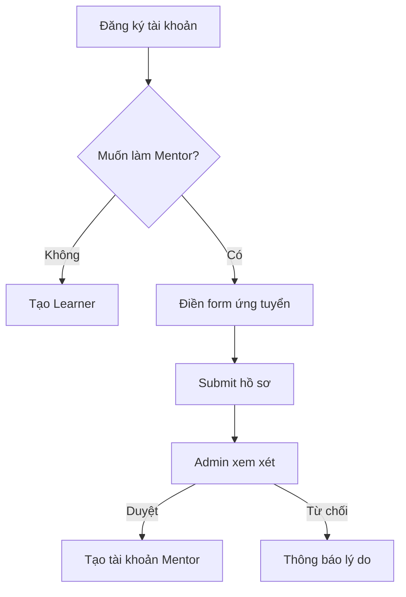

# Mentor Application Feature

## Tổng quan
Cho phép người dùng đăng ký trở thành mentor khi đăng ký tài khoản.

---

## User Flow

---

## API Endpoints

| Endpoint | Method | Description |
|----------|--------|-------------|
| `/api/mentor-application/submit` | POST | Nộp đơn ứng tuyển |
| `/api/mentor-application/status/:id` | GET | Xem trạng thái đơn |
| `/api/mentor-application/by-email/:email` | GET | Tìm đơn theo email |
| `/api/mentor-application/admin/list` | GET | Admin: danh sách đơn |
| `/api/mentor-application/admin/:id` | GET | Admin: xem chi tiết |
| `/api/mentor-application/admin/:id/approve` | POST | Admin: duyệt đơn |
| `/api/mentor-application/admin/:id/reject` | POST | Admin: từ chối |

---

## Form ứng tuyển (4 bước)

### Step 1: Thông tin cá nhân
- Họ tên, email, SĐT, ngày sinh
- Công việc hiện tại, công ty, năm kinh nghiệm

### Step 2: Học vấn & Chứng chỉ
- Trình độ học vấn, chuyên ngành, trường
- Trình độ tiếng Anh (B2-C2-Native)
- Chứng chỉ (IELTS, TOEFL, TOEIC...)

### Step 3: Kinh nghiệm giảng dạy
- Mô tả kinh nghiệm
- Chuyên môn (IELTS, Business, Conversation...)
- Đối tượng học viên (Beginner, Advanced, Kids...)
- Số giờ có thể dạy/tuần

### Step 4: Động lực
- Tại sao muốn làm Mentor
- Phong cách giảng dạy

---

## Trạng thái đơn

| Status | Mô tả |
|--------|-------|
| `pending` | Chờ duyệt |
| `reviewing` | Đang xem xét |
| `approved` | Đã duyệt → Tạo tài khoản Mentor |
| `rejected` | Từ chối → Gửi email lý do |

---

## Files

| File | Description |
|------|-------------|
| [mentor_application_model.py](file:///c:/Users/Dell/Documents/project%20cnpm/Flask-CleanArchitecture/src/infrastructure/models/mentor_application_model.py) | Model lưu trữ đơn ứng tuyển |
| [mentor_application_controller.py](file:///c:/Users/Dell/Documents/project%20cnpm/Flask-CleanArchitecture/src/api/controllers/mentor_application_controller.py) | 7 API endpoints |
| [MentorApplication.tsx](file:///c:/Users/Dell/Documents/project%20cnpm/frontend/src/pages/Auth/MentorApplication.tsx) | Form 4 bước cho ứng viên |
| [MentorApplications.tsx](file:///c:/Users/Dell/Documents/project%20cnpm/frontend/src/pages/Admin/MentorApplications.tsx) | Trang Admin duyệt đơn |
