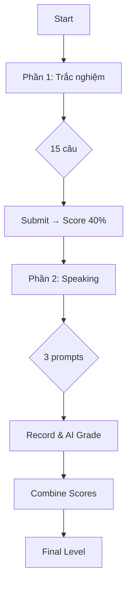

# Placement Test Feature

## Tổng quan
Bài kiểm tra phân loại trình độ kết hợp **Trắc nghiệm + Speaking** với **AI chấm điểm**.

---

## 2 Phần kiểm tra

### ✍️ Phần 1: Trắc nghiệm (40%)
| Thông số | Giá trị |
|----------|---------|
| Số câu | 15 câu |
| Thời gian | 20 phút |
| Nội dung | Grammar, Vocabulary, Reading |

### 🎤 Phần 2: Speaking (60%)
| Thông số | Giá trị |
|----------|---------|
| Số câu | 3 prompts |
| Chấm điểm | AI tự động |
| 5 tiêu chí | Pronunciation, Vocabulary, Grammar, Fluency, Coherence |

---

## Speaking Prompts

| # | Level | Prompt | Duration |
|---|-------|--------|----------|
| 1 | A1-A2 | Introduce yourself | 60s |
| 2 | A2-B1 | Describe daily routine | 90s |
| 3 | B1-B2 | Tell about a trip | 120s |

---

## API Endpoints

| Endpoint | Method | Description |
|----------|--------|-------------|
| `/questions` | GET | Lấy câu hỏi trắc nghiệm |
| `/submit` | POST | Nộp phần trắc nghiệm |
| `/speaking/prompts` | GET | Lấy prompts speaking |
| `/speaking/evaluate` | POST | AI chấm từng câu speaking |
| `/speaking/submit-all` | POST | Nộp tất cả và tính điểm cuối |

---

## Công thức tính điểm

```
Final Score = Written (40%) + Speaking (60%)
```

| Điểm | Level |
|------|-------|
| ≥90% | C1 |
| ≥75% | B2 |
| ≥60% | B1 |
| ≥45% | A2 |
| <45% | A1 |

---

## Files

| File | Description |
|------|-------------|
| [placement_test_model.py](file:///c:/Users/Dell/Documents/project%20cnpm/Flask-CleanArchitecture/src/infrastructure/models/placement_test_model.py) | Models + 14 questions + 3 speaking prompts + AI grading template |
| [placement_test_controller.py](file:///c:/Users/Dell/Documents/project%20cnpm/Flask-CleanArchitecture/src/api/controllers/placement_test_controller.py) | 7 endpoints (4 written + 3 speaking) |
| [PlacementTest.tsx](file:///c:/Users/Dell/Documents/project%20cnpm/frontend/src/pages/Learner/PlacementTest.tsx) | 4-stage UI with audio recording |

---

## Flow


